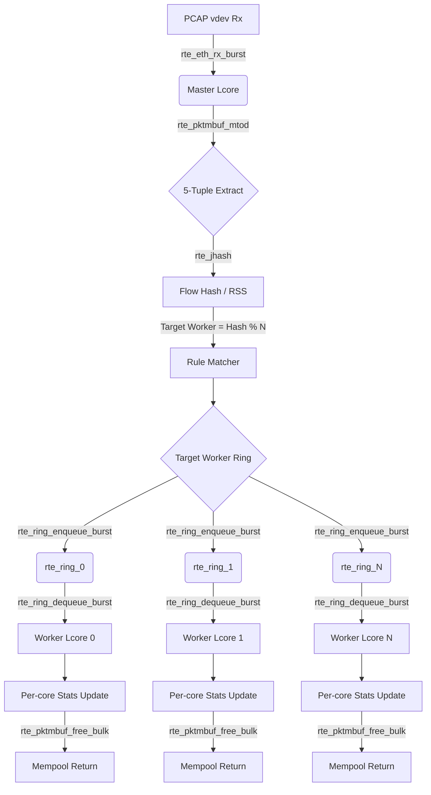

Dưới đây là toàn bộ nội dung file README của bạn đã được dịch sang tiếng Việt, sử dụng các thuật ngữ chuyên ngành Công nghệ thông tin, Mạng máy tính và Điện toán hiệu năng cao (HPC) một cách chuẩn xác và mượt mà:

---

# SPIFast - Hệ thống phân loại gói tin hiệu năng cao dùng DPDK

SPIFast là một hệ thống Kiểm tra gói tin nông (Shallow Packet Inspection - SPI) hiệu năng cao được xây dựng bằng ngôn ngữ C11 và thư viện DPDK. Hệ thống thực hiện phân loại lưu lượng mạng dựa trên các trường tiêu đề 5-tuple (IP nguồn, IP đích, Cổng nguồn, Cổng đích, Giao thức) ở tốc độ đường truyền Gigabit (Line-rate) nhờ vào kiến trúc đường ống đa lõi không dùng khóa (lock-free multi-core pipeline architecture).

## 🚀 Tính năng nổi bật

* **Kiến trúc Không-sao-chép (Zero-Copy):** Phân tích cú pháp gói tin trực tiếp ngay trên bộ nhớ (in-place) sử dụng các phân vùng mempool của DPDK.
* **Đa luồng Không-dùng-khóa (Lock-Free Multi-Threading):** Các lõi Master (Nhận/Phân phối) và Worker giao tiếp trực tiếp với nhau thông qua hàng đợi `rte_ring`.
* **Cân bằng tải động:** Cơ chế phần mềm RSS (Sử dụng hàm băm Jenkins Hash) đảm bảo tính đồng nhất luồng dữ liệu (flow affinity) một cách định trước.
* **Cập nhật luật thời gian thực (Hot-Reloadable):** Cập nhật bộ luật phân loại ngay khi ứng dụng đang chạy thông qua cơ chế Unix Domain Sockets mà không cần phải khởi động lại hệ thống.

---

## 🛠️ Yêu cầu hệ thống

* Hệ điều hành Linux (Khuyến nghị dùng Ubuntu 20.04/22.04/24.04)
* Các công cụ: GCC, Make, Python 3, `tcpreplay`
* Trình quản lý build Meson (>= 1.3.2) và Ninja
* DPDK 24.11 (được cài đặt cục bộ thông qua script đi kèm)

---

## ⚙️ 1. Cài đặt và Cấu hình dự án

Thực hiện chính xác theo các bước sau để thiết lập môi trường, biên dịch DPDK và cấp phát bộ nhớ Hugepages.

### Bước 1.1: Cài đặt các gói phụ thuộc (Dependencies)

```bash
sudo apt update
sudo apt install -y build-essential python3 python3-pip python3-venv tcpreplay pkg-config cmake
pip3 install meson ninja

```

### Bước 1.2: Thiết lập môi trường ảo Python (Phục vụ cho các script sinh test)

```bash
python3 -m venv venv
source venv/bin/activate
pip install scapy

```

### Bước 1.3: Tải và Biên dịch DPDK

Dự án đã tích hợp sẵn một script tự động để tải và biên dịch DPDK cục bộ ngay bên trong thư mục `third_party/`.

```bash
chmod +x scripts/setup_dpdk/setup_dpdk.sh
./scripts/setup_dpdk/setup_dpdk.sh

```

### Bước 1.4: Cấp phát bộ nhớ Hugepages (Bắt buộc)

DPDK yêu cầu bộ nhớ Hugepages để thiết lập các pool bộ nhớ không-sao-chép (zero-copy memory pool). **Bạn bắt buộc phải chạy lệnh này sau mỗi lần khởi động lại máy tính.**

```bash
chmod +x scripts/setup_hugepages/*.sh
sudo ./scripts/setup_hugepages/setup_hugepages.sh

```

---

## 🏗️ 2. Biên dịch dự án

Cấu hình thư mục build bằng `meson` và thiết lập biến môi trường `PKG_CONFIG_PATH` trỏ tới phân vùng DPDK vừa biên dịch cục bộ.

```bash
# Xuất biến PKG_CONFIG_PATH để meson tìm thấy bản DPDK cục bộ của chúng ta
export PKG_CONFIG_PATH="$PWD/third_party/dpdk-24.11/build/meson-uninstalled"

# Thiết lập thư mục build
meson setup build

# Tiến hành biên dịch dự án
ninja -C build

```

Sau khi biên dịch thành công, 3 file thực thi (binary) sẽ được tạo ra trong thư mục `build/`:

* `spifast`: Ứng dụng phân loại SPI bản Production đã được tối ưu hóa kịch khung.
* `spifast_debug`: Phiên bản chạy ở chế độ Debug kèm theo các cờ kiểm thử tính đúng đắn của chức năng.
* `spi_cli`: Công cụ dòng lệnh hỗ trợ nạp lại cấu hình thời gian thực (live reload).

---

## 🏃 3. Vận hành dự án

### Chạy ở chế độ Production / Native Mode

Mở ứng dụng trực tiếp bằng các script đo kiểm đi kèm. Các script này đã tự động xử lý các tham số EAL của DPDK và cấu hình map thiết bị mạng ảo PCAP `vdev` một cách chuẩn xác.

```bash
sudo ./tests/judge/run_project_native.sh

```

### Chạy ở chế độ truyền dữ liệu với `tcpreplay` (Dành cho file PCAP lớn)

```bash
sudo ./tests/judge/run_project_tcpreplay.sh

```

### Cập nhật luật thời gian thực (Hot-Reloading)

Trong khi ứng dụng `spifast` vẫn đang chạy, bạn hãy mở một cửa sổ terminal mới. Bạn có thể chỉnh sửa file luật `spi_rules.conf` và tiến hành nạp trực tiếp bộ luật mới vào hệ thống mà không làm rớt bất kỳ gói tin nào:

```bash
sudo ./build/spi_cli reload_rules ./spi_rules.conf

```

---

## 🧪 4. Đo kiểm hiệu năng (Benchmarking) & Kiểm thử tính đúng đắn

Thư mục `tests/judge/` chứa toàn bộ các bộ kiểm thử tự động.
*Lưu ý: Đảm bảo rằng bạn đã kích hoạt môi trường ảo Python `venv` trước khi chạy các bài test tính đúng đắn, vì kịch bản này cần thư viện `scapy` để sinh dữ liệu.*

### Kiểm tra tính đúng đắn của chức năng (Functional Correctness)

Kịch bản này sẽ tự động sinh ra 240 gói tin định trước bao phủ toàn bộ các trường hợp biên và kiểm thử lỗi, đẩy chúng qua đường ống xử lý SPI, sau đó đối chiếu kết quả thực tế thu được với kết quả kỳ vọng ban đầu.

```bash
# Hãy chắc chắn rằng venv đã được kích hoạt trước!
source venv/bin/activate
sudo ./tests/judge/run_check_correctness.sh

```

### Chạy đo kiểm hiệu năng hệ thống (Performance Benchmarks)

Hệ thống cung cấp hai chế độ đo hiệu năng tùy thuộc vào dung lượng file PCAP của bạn:

```bash
# 1. Native Mode (Dành cho file PCAP nhỏ < 8K gói tin)
# Đạt hiệu năng kịch trần (line-rate) nhờ việc bypass (bỏ qua) hoàn toàn nhân Linux kernel.
sudo ./tests/judge/run_benchmark_native.sh

# 2. TCPReplay Mode (Dành cho file PCAP lớn trên 1M gói tin)
# Truyền luồng dữ liệu thông qua giao tiếp mạng ảo (veth). Tránh được lỗi cạn kiệt bộ nhớ mbuf pool của DPDK.
sudo ./tests/judge/run_benchmark_tcpreplay.sh

```

### Nơi xem toàn bộ Kết quả đầu ra (Results Output)

Toàn bộ quá trình chạy chương trình, file log chi tiết và kết quả đo kiểm hiệu năng (Benchmarks) sẽ được tự động lưu lại và bạn có thể xem toàn bộ tại thư mục **[tests/results/](tests/results/)** dưới dạng các file định dạng `.csv` và `_log.txt`.

Để xem hướng dẫn chi tiết về khung kiểm thử, vui lòng tham khảo [Tài liệu hướng dẫn đo kiểm (Benchmarking Guide)](tests/judge/README.md).

---
## 5. Kết quả đo đạc thực tế 

### 5.1. Kiểm tra tính đúng đắn của hệ thống (Functional Correctness)

Trước khi thực hiện đo kiểm hiệu năng, hệ thống đã phải vượt qua các bài kiểm thử khắt khe về tính đúng đắn khi xử lý gói tin (phân loại đúng luật, không bỏ sót gói). Dưới đây là kết quả kiểm thử chức năng tự động trích xuất từ file `tests/results/testcase_results.csv`:

| Tiêu chí (Metric) | Kết quả (Value) | Đánh giá |
| :--- | :--- | :--- |
| **Tổng số gói tin (Total Packets)** | 239 | |
| **Phân loại khớp (Matched)** | 239 | |
| **Bỏ sót (Missing)** | 0 | 🟢 **Tuyệt đối** |
| **Sai lệch (Mismatched)** | 0 | 🟢 **Tuyệt đối** |
| **Độ chính xác (Accuracy)** | **100.00%** | 🎯 **Hoàn hảo** |

---

### 5.2. Bảng kết quả Hiệu năng Benchmarks (Thực tế vs. Tối đa lý thuyết)

#### 5.2.1. Chế độ đo tốc độ lý thuyết thuần túy (Raw Throughput - Không xử lý)
**Đặc điểm:** Chế độ này dùng để đo đạc khả năng truyền tải dữ liệu thô tối đa của `tcpreplay` bơm vào `veth` interface mà hệ thống hoàn toàn không kích hoạt bộ xử lý gói tin (SPI engine bypass). Đây là tốc độ trần (ceiling) của Kernel mạng để so chiếu.

| File PCAP | Thông lượng (Throughput) | Tốc độ gói tin (Flow Rate) |
| :--- | :--- | :--- |
| `balanced_traffic.pcap` | **2,942.94 Mbps** | 627,693 pps |
| `telco_traffic.pcap` | **3,062.50 Mbps** | 655,389 pps |
| `tls13-rfc8446.pcap` | **1,170.35 Mbps** | 448,730 pps |
| `http.pcap` | **110.58 Mbps** | 59,840 pps |

#### 5.2.2. Chế độ Native Mode (Bypass Kernel hoàn toàn)
**Đặc điểm:** Ở chế độ này, DPDK sử dụng PCAP Poll Mode Driver (PMD) để nạp trước (preload) toàn bộ file PCAP vào bộ nhớ RAM và đọc trực tiếp từ đó theo vòng lặp. Quá trình xử lý gói tin hoàn toàn đi vòng qua (bypass) nhân hệ điều hành Linux (Kernel) và ngăn xếp mạng tiêu chuẩn (TCP/IP stack). Do không có độ trễ I/O từ giao tiếp mạng thực tế, đây là bài test thể hiện sức mạnh điện toán thuần túy (Raw Compute Power) và thông lượng tối đa tuyệt đối mà phần mềm có thể đạt được.

| File PCAP | Thông lượng (Throughput) | Tốc độ gói tin (Flow Rate) |
| :--- | :--- | :--- |
| `tls13-rfc8446.pcap` | **45,555.23 Mbps** | 18,855,643 pps |
| `http.pcap` | **42,079.77 Mbps** | 25,410,492 pps |
| `balanced_traffic.pcap` | *0.00 Mbps* | *⚠️ Không chạy được (Tràn RAM)* |
| `telco_traffic.pcap` | *0.00 Mbps* | *⚠️ Không chạy được (Tràn RAM)* |

#### 5.2.3. Chế độ TCPReplay Mode (Bơm gói tin qua Veth Interface)
**Đặc điểm:** Chế độ này mô phỏng môi trường mạng sát với thực tế hơn bằng cách sử dụng công cụ `tcpreplay` để bơm luồng gói tin thực tế vào một thiết bị mạng ảo (veth interface) của Linux Kernel. Sau đó, ứng dụng DPDK sẽ kéo (poll) các gói tin này từ veth ra để xử lý. Khác với Native Mode, chế độ này phụ thuộc và bị giới hạn trực tiếp bởi tốc độ định tuyến tối đa của ngăn xếp mạng nhân Linux (Linux Kernel Network Stack) – vốn luôn là nút thắt cổ chai (bottleneck) của mọi hệ thống.

| File PCAP | Thông lượng (Throughput) | Tốc độ gói tin (Flow Rate) |
| :--- | :--- | :--- |
| `balanced_traffic.pcap` | **2,003.79 Mbps** | 445,685 pps |
| `telco_traffic.pcap` | **1,908.53 Mbps** | 426,010 pps |
| `tls13-rfc8446.pcap` | 734.91 Mbps | 304,187 pps |
| `http.pcap` | 62.89 Mbps | 37,976 pps |

---

## 6. Kiến trúc dự án và Sơ đồ hoạt động

### 6.1  Thuật toán cốt lõi và các kỹ thuật tối ưu hóa hiệu năng (HPC Optimizations)

Để đạt được hiệu năng xử lý gói tin tiệm cận tốc độ đường truyền (Line-rate) mà không gây rớt gói, hệ thống áp dụng các thuật toán và kỹ thuật tối ưu hóa HPC sau:

#### 6.1.1. Thuật toán phân luồng và cân bằng tải động (Software RSS Load Balancing)
*   **RSS Hash với `rte_jhash_3words`**: Nhằm duy trì tính nhất quán dòng dữ liệu (Flow Affinity) và giữ bộ đệm L1/L2 của CPU luôn ấm (warm caches), Master Core tính toán mã băm (Hash) dựa trên 5-tuple của gói tin sử dụng hàm Jenkins Hash tối ưu hóa của DPDK:
    ```c
    uint32_t hash = rte_jhash_3words(meta->tuple.src_ip, meta->tuple.dst_ip,
        ((uint32_t)meta->tuple.src_port << 16) | meta->tuple.dst_port,
        meta->tuple.protocol);
    ```
*   **Tối ưu phép chia dư (Fast Modulo)**: Số lượng Worker Core được thiết kế là lũy thừa của 2 (ví dụ: 1, 2, 4, 8...). Nhờ đó, phép toán chia lấy dư (`%`) đắt đỏ được thay thế bằng phép toán logic bit AND (`&`) cực nhanh để xác định Core đích xử lý gói tin:
    ```c
    target_worker = hash & (num_workers - 1);
    ```

#### 6.1.2. Cơ chế thay đổi bảng luật động không khóa (Lock-Free Double-Buffered Rule Table)
Để hỗ trợ vừa chạy phân loại gói tin vừa cập nhật bảng luật cấu hình (Hot-reload) từ CLI mà không gây suy hao hiệu năng do tranh chấp khóa (Lock Contention):
*   **Cơ chế đệm kép (Double Buffering)**: Hệ thống duy trì hai bảng luật song song: `g_rule_table_a` và `g_rule_table_b` (đều được căn lề cache-line).
*   **Con trỏ nguyên tử (Atomic Pointer Switch)**: Một con trỏ nguyên tử `_Atomic(spi_rule_t *) g_active_rules` luôn chỉ tới bảng luật đang kích hoạt. Khi có yêu cầu tải lại luật mới, luồng điều khiển sẽ parse luật mới vào bảng đệm ẩn (shadow table), sau đó thực hiện tráo đổi con trỏ bằng lệnh ghi nguyên tử đồng bộ bộ nhớ giải phóng (`atomic_store_explicit` với `memory_order_release`):
    ```c
    atomic_store_explicit(&g_active_rules, shadow, memory_order_release);
    ```
*   **Độc giả không khóa (Lock-Free Reader)**: Worker Core nạp con trỏ bảng luật một lần cho mỗi burst gói tin bằng lệnh đọc thu nhận (`atomic_load_explicit` với `memory_order_acquire`). Worker xử lý trọn vẹn burst hiện tại trên bảng luật cũ trong khi bảng luật mới đã được swap cho burst kế tiếp, đảm bảo tính nhất quán dữ liệu mà không cần dùng Mutex hay Spinlock.

#### 6.1.3. Kỹ thuật nạp trước dữ liệu (Memory Prefetching)
Để che giấu độ trễ truy xuất RAM (Memory Latency Overhead), Worker Core liên tục nạp trước (prefetch) siêu dữ liệu gói tin (`rte_mbuf`) và vùng chứa header của các gói tin tiếp theo vào bộ nhớ cache L1 của CPU trước khi thực tế thao tác trên nó:
```c
if (likely(i + 4 < nb_rx)) {
    rte_prefetch0(bufs[i + 4]);                          // Prefetch mbuf header
    rte_prefetch0(rte_pktmbuf_mtod(bufs[i + 4], void *)); // Prefetch packet payload/headers
}
```

#### 6.1.4. Các kỹ thuật tối ưu hóa HPC khác
*   **Zero-Copy Parser**: Sử dụng macro `rte_pktmbuf_mtod` để ép kiểu trực tiếp con trỏ vùng nhớ gói tin sang các cấu trúc tiêu đề mạng (`struct rte_ipv4_hdr`, `struct rte_tcp_hdr`) mà không cần sao chép bộ nhớ (`memcpy`).
*   **Tránh False Sharing**: Đánh dấu các cấu trúc thống kê cục bộ bằng `__rte_cache_aligned` (căn lề theo cache-line 64 bytes) để đảm bảo mỗi Worker ghi dữ liệu lên vùng nhớ độc lập, tránh xung đột bộ đệm L2/L3 giữa các nhân CPU khác nhau.
*   **Gộp nhóm xử lý (Batching)**: Nhận gói (`rte_eth_rx_burst`), truyền gói (`rte_ring_enqueue_burst`), và giải phóng bộ nhớ (`rte_pktmbuf_free_bulk`) theo từng nhóm (Burst) để giảm thiểu chi phí overhead gọi hàm và tranh chấp khóa của Mempool.

### 6.2. Cấu trúc thư mục mã nguồn (`src/`)

Dưới đây là sơ đồ cây thư mục chi tiết của phân hệ xử lý chính ([src/](file:///c:/Users/ADMIN/Desktop/coding/hpc-spi-classifier/src)) và mô tả vai trò của từng thành phần:

```text
src/
├── main.c           # Điểm khởi đầu (Entry Point), khởi tạo cấu hình DPDK EAL, Mempool, Ring và phân bổ các core
├── common.h         # Định nghĩa các cấu trúc dữ liệu dùng chung (five_tuple_t, spi_rule_t, core_config_t)
├── master.c/.h      # Logic của Master Core: nhận gói tin từ PCAP/vdev, phân tích và phân phối (Dispatch) tới Worker Cores
├── worker.c/.h      # Logic của các Worker Cores: lấy gói tin từ vòng ring, so khớp luật và giải phóng bộ nhớ gói tin
├── matcher.c/.h     # Bộ so khớp luật Shallow Packet Inspection (SPI) dựa trên 5-tuple của gói tin
├── parser.h         # Bộ phân tích tiêu đề gói tin (L2/L3/L4 Headers Parser) với cơ chế Zero-copy
├── control.c/.h     # Các hàm điều khiển hệ thống, tải tập luật cấu hình và đồng bộ hóa trạng thái
├── stats.c/.h       # Quản lý và in thống kê hiệu năng hệ thống (Mbps, pps, drop/hit rate) định kỳ mỗi 1 giây
└── spi_cli.c        # Tiện ích dòng lệnh (CLI) tương tác điều khiển động hệ thống
```

### 6.3. Sơ đồ dòng dữ liệu (Data Flow & Pipeline Model)

Hệ thống hoạt động theo mô hình Pipeline song song phi trạng thái (Stateless Lock-free Pipeline). Dòng dữ liệu từ khi nhận gói tin cho đến khi xử lý hoàn tất được mô tả qua sơ đồ Mermaid dưới đây:



### 6.4. Chi tiết chức năng các phân hệ

1. **Khởi tạo hệ thống (`main.c`)**: Khởi tạo môi trường DPDK EAL, tạo `rte_mempool` để chứa gói tin, tạo các hàng đợi vòng khóa `rte_ring` và cấu hình cổng mạng ảo `net_pcap`.
2. **Nhận và phân phối gói tin (`master.c`)**: Chạy vòng lặp vô hạn trên lcore Master, liên tục nhận burst gói tin từ cổng mạng ảo. Với mỗi gói tin, Master trích xuất địa chỉ IP, Port và Protocol (5-tuple), sau đó dùng thuật toán `rte_jhash` để tính toán phân bổ tải (Dynamic Load Balancing) và đưa gói tin vào hàng đợi `rte_ring` tương ứng của các Worker Cores.
3. **So khớp luật (`matcher.c`, `parser.h`)**: Sử dụng phương pháp Zero-copy (`rte_pktmbuf_mtod`) để đọc tiêu đề gói tin mà không cần sao chép bộ nhớ. Bộ so khớp đối chiếu thông tin 5-tuple với tập luật được cấu hình sẵn để phân loại lưu lượng.
4. **Xử lý song song (`worker.c`)**: Mỗi lcore Worker được gắn với một hàng đợi `rte_ring` riêng. Worker thực hiện poll gói tin, ghi nhận thông số thống kê cục bộ, sau đó giải phóng gói tin hàng loạt bằng `rte_pktmbuf_free_bulk` để tối ưu hóa hiệu năng Mempool.
5. **Thống kê hiệu năng (`stats.c`)**: Tổng hợp dữ liệu từ các Worker Cores và in ra màn hình thông lượng (Mbps), tốc độ gói (pps) và tỷ lệ trượt/khớp định kỳ mỗi giây, sử dụng kỹ thuật tránh False Sharing (`__rte_cache_aligned`).


