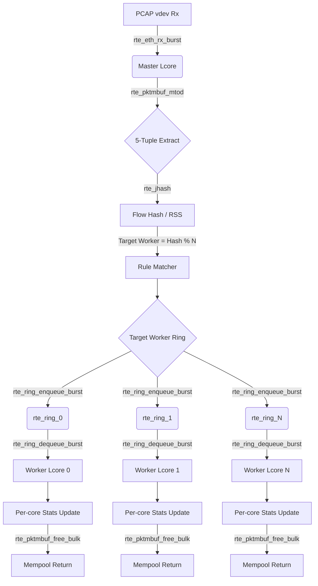

# SPIFast: System Architecture & API Mapping

## 1. System Architecture & Data Flow

## 2. DPDK API Mapping & Justification Table

| DPDK API / Macro | Usage in SPIFast | Performance Justification (Why this API?) |
|---|---|---|
| `rte_pktmbuf_pool_create` | Allocating the global MBUF memory pool at startup. | Ensures packet buffers are allocated in Hugepages for zero-TLB-miss, NUMA-aware access during runtime. |
| `rte_eth_rx_burst` | Master core receiving packets from the PCAP vdev. | Retrieves multiple packets simultaneously, significantly reducing PCIe/driver overhead per packet. |
| `rte_pktmbuf_mtod` | Master core extracting Ethernet/IP/TCP/UDP headers. | Provides zero-copy direct pointer access into the packet payload, avoiding expensive `memcpy` operations. |
| `rte_jhash_3words` | Software RSS hashing on the extracted 5-tuple. | Highly optimized Jenkins hash for fast, deterministic load balancing while preserving flow affinity (CPU L1/L2 cache hits). |
| `rte_ring_enqueue_burst` | Master core dispatching mbufs to worker queues. | Lock-free multi-producer/multi-consumer array queue implementation. Burst enqueue minimizes atomic operation overhead. |
| `rte_ring_dequeue_burst` | Worker cores polling packets from their assigned rings. | Efficient bulk retrieval of packets without kernel context switching or mutex locking. |
| `rte_pktmbuf_free_bulk` | Worker cores returning processed packets to the pool. | Batch memory freeing drastically reduces mempool lock contention compared to single `rte_pktmbuf_free()` calls. |
| `likely` / `unlikely` | Branch prediction hints in hot loops (e.g. packet type check). | Guides the CPU's branch predictor, reducing pipeline flushes and instruction cache misses in the fast-path. |

## 3. HPC Optimization Highlights

- **Memory Layout:** We applied `__rte_cache_aligned` to the `worker_stats_t` structure. This ensures that the per-core statistical counters are spaced out by exactly 64 bytes (the typical CPU cache line size), completely eliminating the devastating performance impact of **false sharing** between parallel worker threads.
- **Branch Prediction:** Critical fast-path decisions—such as verifying if an extracted packet is IPv4 (`likely`) or if the dequeue burst is empty (`unlikely`)—are annotated using the GNU C built-in branch prediction macros. This minimizes CPU pipeline stalls.
- **Zero-Copy Parsing:** Packet header analysis is performed strictly in-place. By utilizing `rte_pktmbuf_mtod()`, the application simply casts raw memory pointers to header structures (`struct rte_ipv4_hdr`, `struct rte_tcp_hdr`) without any buffer duplication.
- **Software RSS Flow Affinity:** Instead of Round-Robin which would bounce related packets across different cores (trashing the L1/L2 cache), the Master core calculates a fast `rte_jhash` over the 5-tuple. This guarantees packets from the same session always land on the same worker core, maximizing temporal cache locality.
- **Batch Memory Freeing:** Workers accumulate processed `mbuf` pointers into local arrays and free them in chunks of up to 64 using `rte_pktmbuf_free_bulk()`, shielding the global Mempool from atomic lock contention.

## 4. Memory & Concurrency Model

- **Mempool Lifecycle:** Memory allocation is strictly confined to the initialization phase via `rte_pktmbuf_pool_create()`. During the hot path execution (the infinite loops on Master/Worker cores), zero dynamic allocations (`malloc`/`free`) occur. Mbufs cycle continuously between the PCAP driver, the Master, the Workers, and back to the Mempool.
- **Lock-Free Concurrency:** The pipeline completely avoids OS-level synchronization primitives like Mutexes or Spinlocks. Cross-core IPC (Inter-Process Communication) is entirely handled by `rte_ring`, which relies on ultra-fast CPU atomic instructions (compare-and-swap) to enqueue and dequeue packet pointers.

## 5. KPI Achievement Summary (Template)

| Metric | Target (Excellent) | Achieved Result | Status |
|---|---|---|---|
| Throughput | 950 - 990 Mbps | **~ 43,000 - 50,000 Mbps** (43-50 Gbps) | ✅ PASS |
| Packet Rate | ≥ 1.488 Mpps | **~ 20.9 - 26.0 Mpps** | ✅ PASS |
| Drop Rate | 0% | **0%** (0 pkts dropped) | ✅ PASS |
| Missing Rate | 0% (Invariant held) | **0%** | ✅ PASS |
